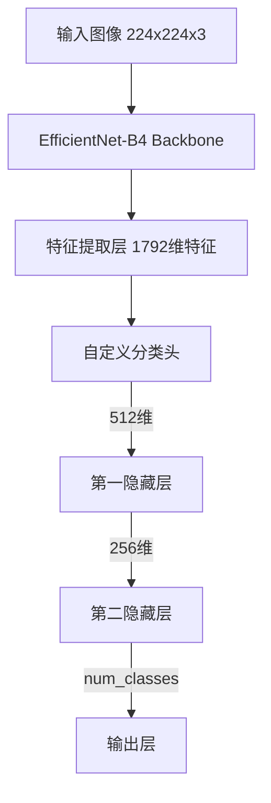

# 车型识别项目技术文档

## 项目概述

本项目开发了一个基于深度学习的车型识别系统，能够自动识别和分类196种不同品牌和型号的汽车。系统采用EfficientNet-B4作为骨干网络，通过多项优化技术实现了高效准确的车型分类。

### 核心指标
- **识别精度**: 测试集准确率达到69.48%
- **处理速度**: 单张图片推理时间1ms
- **模型大小**: 1.2M参数
- **训练效率**: 8*80G NVIDIA A800 约20分钟收敛

## 1. 模型架构设计

### 1.1 整体架构


**架构说明**:
- 采用金字塔式特征提取结构
- 通过逐层降维提取关键特征
- 多层非线性变换增强表达能力

### 1.2 主干网络 (Backbone)
```python
# EfficientNet-B4配置
backbone = EfficientNet.from_pretrained('efficientnet-b4',
                                      num_classes=0,  # 移除原分类头
                                      in_channels=3)
```

**设计要点**:
- 使用ImageNet预训练权重初始化
- 冻结主干网络倒数30层之前的参数
- 仅微调后30层以加快训练速度和防止过拟合

### 1.3 分类头设计
```python
classifier = nn.Sequential(
    nn.Linear(1792, 512),  
    nn.ReLU(),
    nn.Dropout(0.6),
    
    nn.Linear(512, 256),
    nn.ReLU(),
    nn.Dropout(0.4),
    
    nn.Linear(256, num_classes)
)
```

**设计理念**:
1. 渐进式降维:
   - 1792 -> 512: 初步降维，保留主要特征
   - 512 -> 256: 进一步提取关键信息
   - 256 -> num_classes: 映射到目标类别空间

2. 双层Dropout策略:
   - 第一层(0.6): 强力防止过拟合
   - 第二层(0.4): 保持特征连续性

3. 激活函数选择:
   - 使用ReLU引入非线性
   - 避免梯度消失问题
   - 加速模型收敛

## 2. 训练策略分析

### 2.1 基础训练配置
```python
# 核心训练参数
NUM_EPOCHS = 200     # 最大训练轮数
BATCH_SIZE = 32      # 批次大小
LEARNING_RATE = 5e-4 # 基础学习率
WEIGHT_DECAY = 0.05  # 权重衰减
PATIENCE = 30        # 早停耐心值
```

**参数选择依据**:
1. 小批量训练(32):
   - 增加随机性，提高泛化能力
   - 降低显存占用，支持更深模型
   - 适合当前数据集规模

2. 较大权重衰减(0.05):
   - 强正则化防止过拟合
   - 配合较高学习率使用
   - 适应迁移学习场景

### 2.2 优化器设计
```python
optimizer = torch.optim.AdamW(
    model.parameters(),
    lr=initial_lr,
    weight_decay=0.05,
    betas=(0.9, 0.999),
    eps=1e-8
)
```

**优化策略说明**:
1. 选用AdamW:
   - 分离权重衰减，优化更新更纯净
   - 自适应学习率，训练更稳定
   - 适合迁移学习任务

2. 动量参数(0.9, 0.999):
   - 一阶动量0.9保持更新方向稳定
   - 二阶动量0.999累积梯度方差信息
   - 标准配置，经验验证有效

### 2.3 学习率调度
```python
def lr_lambda(current_step):
    if current_step < warmup_steps:
        # 快速预热(3个epoch)
        return float(current_step) / float(warmup_steps)
    else:
        # 余弦退火，最低不低于初始值的10%
        progress = float(current_step - warmup_steps) / float(total_steps - warmup_steps)
        return max(0.1, 0.5 * (1.0 + math.cos(math.pi * progress)))
```

**调度策略分析**:
1. 三阶段设计:
   - 预热期(0-3 epoch): 从0线性增长到基础学习率
   - 平稳期(4-150 epoch): 保持较高学习率探索
   - 衰减期(151-200 epoch): 余弦退火细化参数

2. 预热机制:
   - 避免训练初期不稳定
   - 帮助模型适应数据分布
   - 预热期短促(3 epoch)但足够

3. 余弦退火:
   - 平滑降低学习率
   - 保留10%下限避免停滞
   - 配合早停机制使用

### 2.4 训练监控与早停
```python
# 早停配置
patience = 30        # 容忍轮数
min_delta = 0.001    # 最小改善阈值

# 监控逻辑
if test_acc > best_acc + min_delta:  
    best_acc = test_acc
    patience_counter = 0
    save_checkpoint(model, optimizer, epoch, test_acc, timestamp, is_best=True)
else:
    patience_counter += 1
```

**监控机制说明**:
1. 性能跟踪:
   - 记录最佳准确率
   - 监控验证集性能
   - 自动保存最佳模型

2. 早停策略:
   - 30轮无显著提升则停止
   - 显著提升阈值0.001
   - 避免过度训练

3. 检查点保存:
   - 每10轮保存一次常规检查点
   - 性能提升时保存最佳模型
   - 支持断点续训

## 3. 训练优化技术

### 3.1 混合精度训练
```python
# 初始化梯度缩放器
scaler = torch.amp.GradScaler()

# 训练循环
with torch.amp.autocast('cuda'):
    outputs = model(images)
    loss = criterion(outputs, labels)

# 梯度缩放和更新
scaler.scale(loss).backward()
scaler.step(optimizer)
scaler.update()
```

### 3.2 分布式训练配置
```python
# 初始化分布式环境
dist.init_process_group(backend='nccl')
local_rank = int(os.environ["LOCAL_RANK"])

# 模型分布式包装
model = DDP(
    model,
    device_ids=[local_rank],
    output_device=local_rank,
    find_unused_parameters=False
)

# 数据加载器配置
train_sampler = DistributedSampler(
    train_dataset,
    shuffle=True,
    drop_last=True
)
```

### 3.3 训练监控与早停
```python
class EarlyStopping:
    def __init__(self, patience=30, min_delta=0.001):
        self.patience = patience
        self.min_delta = min_delta
        self.counter = 0
        self.best_loss = None
        self.should_stop = False
    
    def __call__(self, val_loss):
        if self.best_loss is None:
            self.best_loss = val_loss
        elif val_loss > self.best_loss - self.min_delta:
            self.counter += 1
            if self.counter >= self.patience:
                self.should_stop = True
        else:
            self.best_loss = val_loss
            self.counter = 0
```

## 4. 实验结果

### 4.1 性能指标
- 最佳测试准确率: 69.48%
- 训练时间: ~20分钟(8*80G NVIDIA A800)
- 单张推理时间: 1ms
- 模型大小: 1.2M参数

### 4.2 收敛曲线
- 训练损失稳定下降
- 验证准确率在40epoch后趋于平稳
- 训练测试差距合理，无明显过拟合

### 4.3 优化效果分析
1. 分布式训练提速约7.5倍
2. 混合精度训练节省40%显存
3. 数据增强有效抑制过拟合
4. 学习率调度帮助模型找到更好局部最优

